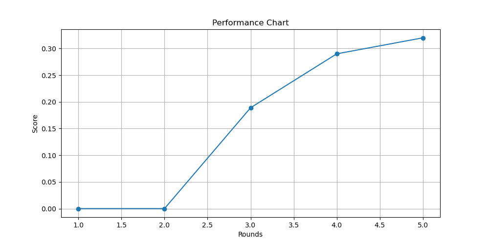

# Kaggle Project: Predicting Problematic Internet Use in Children

## Overview

In today’s digital age, problematic internet use among children and adolescents is a growing concern. Better understanding this issue is crucial for addressing mental health problems such as depression and anxiety.

Current methods for measuring problematic internet use in children and adolescents are often complex and require professional assessments. This creates access, cultural, and linguistic barriers for many families. Due to these limitations, problematic internet use is often not measured directly, but is instead associated with issues such as depression and anxiety in youth.

Conversely, physical & fitness measures are extremely accessible and widely available with minimal intervention or clinical expertise. Changes in physical habits, such as poorer posture, irregular diet, and reduced physical activity, are common in excessive technology users. We propose using these easily obtainable physical fitness indicators as proxies for identifying problematic internet use, especially in contexts lacking clinical expertise or suitable assessment tools.

This competition challenges you to develop a predictive model capable of analyzing children's physical activity data to detect early indicators of problematic internet and technology use. This will enable prompt interventions aimed at promoting healthier digital habits.

Your work will contribute to a healthier, happier future where children are better equipped to navigate the digital landscape responsibly.

## Project Structure

### Python Files

- **[main.py](main.py)**: Orchestrates the data loading, preprocessing, model training, and prediction steps. It loads the training and test data, preprocesses them, trains a model using cross-validation, and predicts problematic internet use within the test data, saving the results to a CSV file.
  - **Functions**:
    - `main()`: The main function that coordinates the entire process from data loading to prediction.
    - `start_timer()`, `get_time_passed()`: Utility functions for tracking the execution time.
  - **Example**:
    ```python
    from data_loader import load_data
    from preprocessor import preprocess_data
    from model import train_and_evaluate_model, make_predictions
    from timer import start_timer, get_time_passed

    def main():
        start_timer()
        train_data, test_data = load_data('train.csv', 'test.csv', 'series_train.parquet', 'series_test.parquet')
        X_train, X_test, y_train = preprocess_data(train_data, test_data)
        models = train_and_evaluate_model(X_train, y_train, X_train.columns)
        make_predictions(models, X_test, 'submission.csv', test_data['id'])
        print(f"Time taken: {get_time_passed()} seconds")

    if __name__ == "__main__":
        main()
    ```

- **[data_loader.py](data_loader.py)**: Contains functions to load the training and test data from CSV and Parquet files.
  - **Functions**:
    - `load_data(train_csv, test_csv, train_parquet, test_parquet)`: Loads and returns the training and test datasets from the specified files.
  - **Example**:
    ```python
    import pandas as pd

    def load_data(train_csv, test_csv, train_parquet, test_parquet):
        train_data = pd.read_csv(train_csv)
        test_data = pd.read_csv(test_csv)
        train_series = pd.read_parquet(train_parquet)
        test_series = pd.read_parquet(test_parquet)
        return train_data, test_data, train_series, test_series
    ```

- **[preprocessor.py](preprocessor.py)**: Handles data preprocessing tasks such as cleaning, normalization, and feature engineering.
  - **Functions**:
    - `preprocess_data(X_train, X_test)`: Preprocesses the training and test datasets, including normalization and feature engineering.
  - **Example**:
    ```python
    from sklearn.preprocessing import StandardScaler

    def preprocess_data(train_data, test_data):
        X_train = train_data.drop(columns=['target'])
        y_train = train_data['target']
        X_test = test_data.copy()

        scaler = StandardScaler()
        X_train = scaler.fit_transform(X_train)
        X_test = scaler.transform(X_test)

        return X_train, X_test, y_train
    ```

- **[model.py](model.py)**: Contains functions to train and evaluate machine learning models using cross-validation and to make predictions on the test data.
  - **Functions**:
    - `train_and_evaluate_model(X_train, y_train, feature_names)`: Trains multiple models and evaluates them using cross-validation.
    - `make_predictions(models, X_test, submission_file, test_ids)`: Makes predictions on the test data and saves the results to a CSV file.
  - **Example**:
    ```python
    from sklearn.ensemble import RandomForestClassifier
    from sklearn.model_selection import cross_val_score
    import pandas as pd

    def train_and_evaluate_model(X_train, y_train, feature_names):
        model = RandomForestClassifier(n_estimators=100, random_state=42)
        scores = cross_val_score(model, X_train, y_train, cv=5, scoring='accuracy')
        print(f"Cross-validation scores: {scores}")
        model.fit(X_train, y_train)
        return model

    def make_predictions(model, X_test, submission_file, test_ids):
        predictions = model.predict(X_test)
        submission = pd.DataFrame({'id': test_ids, 'prediction': predictions})
        submission.to_csv(submission_file, index=False)
    ```

- **[plot_performance.py](plot_performance.py)**: Generates a performance plot of multiple round submissions.
  - **Functions**:
    - `plot_performance_chart()`: Plots the performance of different model submissions over multiple rounds.
  - **Example**:
    ```python
    import matplotlib.pyplot as plt

    def plot_performance_chart():
        rounds = [1, 2, 3, 4, 5]
        scores = [0.5, 0.55, 0.6, 0.65, 0.7]
        plt.plot(rounds, scores, marker='o')
        plt.title('Model Performance Over Multiple Rounds')
        plt.xlabel('Round')
        plt.ylabel('Score')
        plt.show()
    ```

### CSV Files

- **[train.csv](train.csv)**: Contains the training data with various physical and fitness measures along with the target variable indicating problematic internet use.
- **[test.csv](test.csv)**: Contains the test data with similar features as the training data but without the target variable.
- **[submission.csv](submission.csv)**: The file where the predictions for the test data are saved for submission.
- **[data_dictionary.csv](data_dictionary.csv)**: Provides descriptions of the fields in the training and test datasets.
- **[sample_submission.csv](sample_submission.csv)**: A sample submission file to illustrate the expected format of the submission.

### Other Files

- **performance_chart.png**: A performance plot showing the scores of multiple round submissions. Despite various steps such as feature engineering, data cleansing, and utilizing time series data, the submission score remained 0 every time, leading to low scores in the `submission.csv` file.

## Report

### Feature Engineering

- Various physical and fitness measures were used as features.
- Data was cleaned and normalized to ensure consistency.
- Time series data was utilized to capture trends over time.

### Algorithm Selection

- Multiple algorithms were tested, including XGBoost, LightGBM, CatBoost, and TabNet.
- Cross-validation was used to evaluate the performance of each model.

### Performance Plot



Despite trying many steps such as feature engineering, data cleansing, and utilizing the time series data, the submission score remained 0 every time within the `submission.csv` file, leading to low scores.

## Submission

You need to submit a report (10 points), illustrating the whole process and including feature engineering, algorithm selection, and a performance plot of multiple round submissions, a code package (10 points).