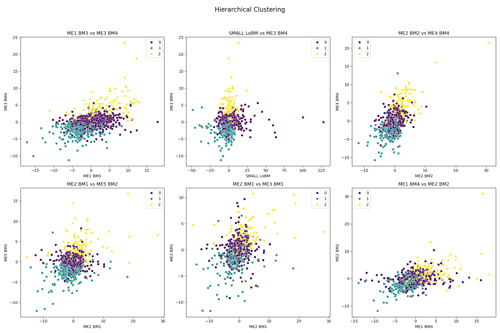
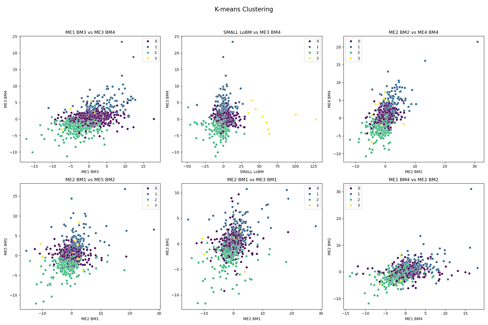

# Clustering Analysis on Portfolio Data

COSI 116A - Introduction to Machine Learning

HW7

James Kong

11/21/24

## Overview

This project performs clustering analysis on a dataset `HW7Portfolio25.csv`, which contains the daily returns of 25 portfolios over 25438 trading days. Additionally, it evaluates the potential of using clustering results to predict the NBER recession index from the dataset `USREC.csv`.

## Files

- `data_loader.py`: Contains functions to load portfolio data from CSV files.
- `model.py`: Contains functions to perform hierarchical and K-means clustering analysis, and to plot clustering results.
- `main.py`: Orchestrates the data loading, clustering analysis, and evaluation steps.
- `HW7Portfolio25.csv`: Portfolio data file.
- `USREC.csv`: NBER recession index data file.
- `cluster_optimization/`: Contains images related to cluster optimization.
- `hierarchical_clustering.png`: Image of the hierarchical clustering results.
- `kmeans_clustering.png`: Image of the K-means clustering results.

## Functions

### `data_loader.py`

- `load_portfolio_data(portfolio_file)`: Loads portfolio data from a CSV file.

### `model.py`

- `hierarchical_clustering(data, n_clusters)`: Performs hierarchical clustering analysis.
- `kmeans_clustering(data, n_clusters)`: Performs K-means clustering analysis.
- `plot_clusters(data, labels, title, filename, features)`: Plots the clustering results.
- `determine_optimal_clusters(data, max_clusters=10, run=False)`: Determines the optimal number of clusters using the Elbow Method and Silhouette Score.

### `main.py`

- `main()`: Orchestrates the data loading, clustering analysis, and evaluation steps.

## Cluster Optimization

To determine the optimal number of clusters, the Elbow Method and Silhouette Score are used. The results are saved as images in the `cluster_optimization` folder.

- **Elbow Method**: The sum of squared distances for different numbers of clusters is plotted to identify the "elbow point," which indicates the optimal number of clusters.
  

- **Silhouette Scores**: The silhouette scores for different numbers of clusters are plotted to identify the number of clusters with the highest score.
  

Based on the Elbow Method and Silhouette Scores, 4 clusters were chosen as the optimal number. The "elbow point" in the Elbow Method plot and the highest average silhouette score both suggested that 4 clusters would provide a good balance between compactness and separation of the clusters.

## Results

The clustering results for hierarchical clustering and K-means clustering are saved as images. In both methods, 6 random pairs of features are selected from the 25 available features to visualize the clustering results. This helps in understanding how the clusters are formed based on different feature combinations.

- **Hierarchical Clustering**:
  

- **K-means Clustering**:
  

## Tasks

### (a)   [35 points] Perform hierarchical clustering analysis. Choose your settings and explain your choices.

### (b)  [35 points] Perform K-mean clustering analysis. Choose your settings and explain your choices.

### (c)   [30 points] Can the above clustering analysis results be used to predict the NBER recession index? Explain your answer.