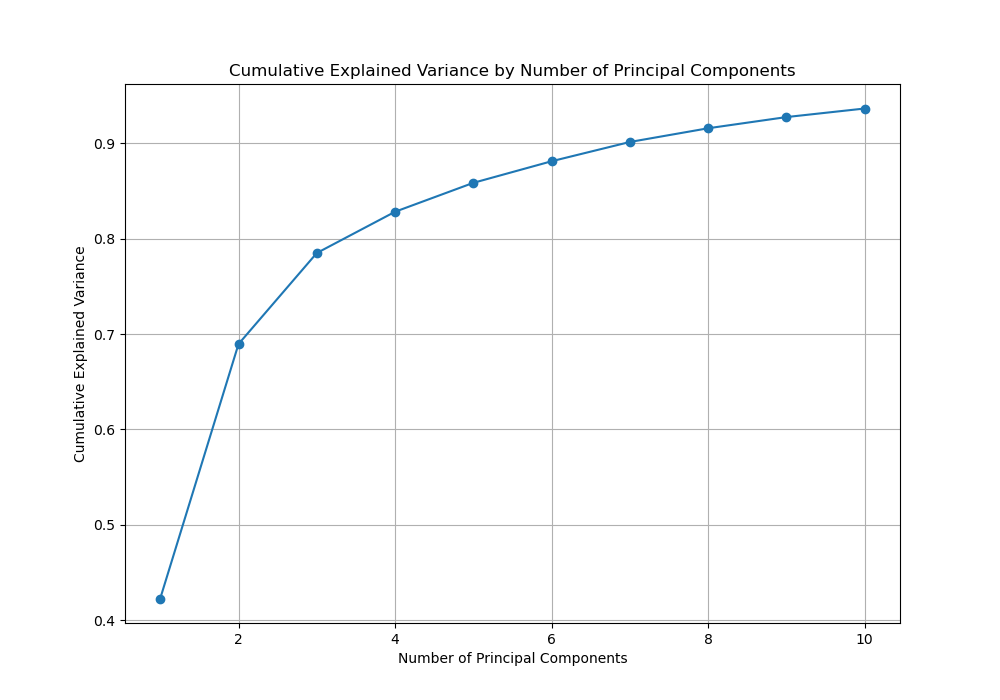
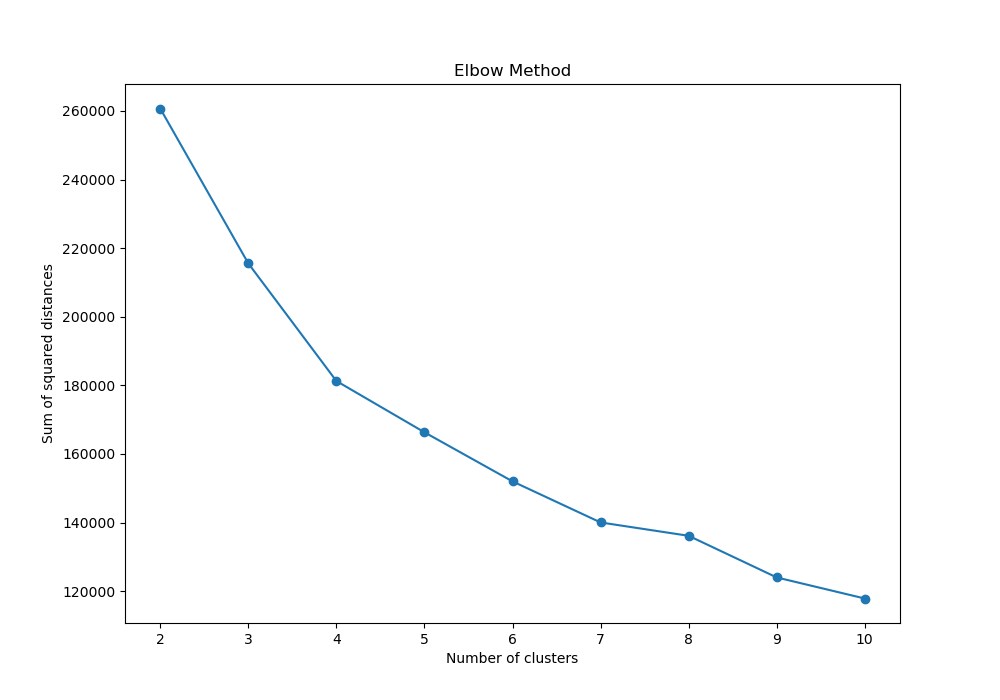
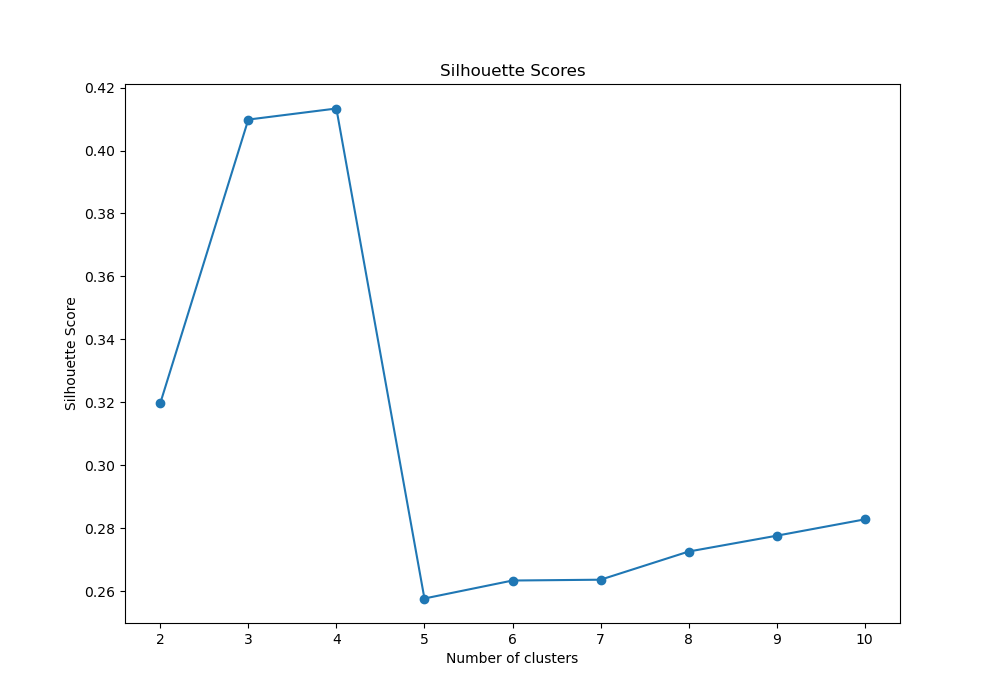

# Clustering Analysis on Portfolio Data

COSI 116A - Introduction to Machine Learning

HW8

James Kong

11/28/24

## Overview

This project performs clustering analysis using PCA on a dataset `HW7Portfolio25.csv`, which contains the daily returns of 25 portfolios over 25438 trading days. Additionally, it evaluates the potential of using clustering results to predict the NBER recession index from the dataset `USREC.csv`.

## Files

- `data_loader.py`: Contains functions to load portfolio data from CSV files.
- `model.py`: Contains functions to perform hierarchical and K-means clustering analysis, determine the optimal number of clusters, and plot clustering results.
- `main.py`: Orchestrates the data loading, clustering analysis, and evaluation steps.
- `HW7Portfolio25.csv`: Portfolio data file.
- `USREC.csv`: NBER recession index data file.
- `cluster_optimization/`: Contains images related to cluster optimization.
- `cumulative_explained_variance.png`: Image showing the cumulative explained variance by the number of principal components.

## Functions

### `data_loader.py`

- `load_data(file)`: Loads data from a CSV file.

### `model.py`

- `hierarchical_clustering(data, n_clusters)`: Performs hierarchical clustering analysis.
- `kmeans_clustering(data, n_clusters, random_state, n_init)`: Performs K-means clustering analysis.
- `determine_optimal_clusters(data, max_clusters=10, run=False)`: Determines the optimal number of clusters using the Elbow Method and Silhouette Score by generating a plot to visualize

### `main.py`

- `main()`: Orchestrates the data loading, clustering analysis, and evaluation steps.

## Required Libraries

The following libraries are required to run the project:

- `pandas`
- `scikit-learn`
- `matplotlib`

### Installation with `pip`

```sh
pip install pandas scikit-learn matplotlib 
```

### Installation with `conda`

```sh
conda install pandas scikit-learn matplotlib 
```

## Data Preprocessing

Before performing clustering analysis, it is essential to ensure that the lengths of the portfolio data and the NBER recession index data match. This is necessary because the clustering results will be compared with the NBER recession index using Normalized Mutual Information (NMI). If the lengths of the datasets do not match, it would lead to misalignment and incorrect evaluation.

In `main.py`, the following steps are performed to ensure the lengths of the datasets match:

```python
# Ensure the lengths of the datasets match
min_length = min(len(portfolio_data), len(nber_data))
portfolio_data = portfolio_data.iloc[:min_length]
nber_labels = nber_data.iloc[:min_length].values.ravel()
```

`min_length` = min(len(portfolio_data), len(nber_data)): This line calculates the minimum length between the portfolio data and the NBER recession index data.

`portfolio_data` = portfolio_data.iloc[:min_length]: This line truncates the portfolio data to the minimum length.

`nber_labels` = nber_data.iloc[:min_length].values.ravel(): This line truncates the NBER recession index data to the minimum length and flattens it into a 1D array.

By ensuring the lengths of the datasets match, we can accurately compare the clustering results with the NBER recession index.

### Determining the Optimal Number of Principal Components

To determine the optimal number of principal components, we plotted the cumulative explained variance for different numbers of components. The graph `cumulative_explained_variance.png` shows that the cumulative variance stops growing fast after 4 components, indicating that 4 is the optimal number of principal components to retain most of the variance in the data.



### Applying PCA

To reduce the dimensionality of the portfolio data, we applied Principal Component Analysis (PCA). We chose to keep 4 principal components, which explained a significant portion of the variance in the data. The following steps are performed in `main.py` to apply PCA:

```python
# Apply PCA
n_components = 4  # Choose the number of principal components
pca_data, explained_variance_ratio = apply_pca(portfolio_data, n_components)
print(f"Explained variance ratio by each component: {explained_variance_ratio}")
```

`n_components = 4`: This line sets the number of principal components to keep.

`pca_data, explained_variance_ratio = apply_pca(portfolio_data, n_components)`: This line applies PCA to the portfolio data and returns the transformed data and the explained variance ratio for each component.

`print(f"Explained variance ratio by each component: {explained_variance_ratio}")`: This line prints the explained variance ratio by each principal component to the console.

By applying PCA, we reduce the dimensionality of the data while retaining most of the variance, making the clustering analysis more efficient and effective.

## Clustering Settings

### Hierarchical Clustering

In `model.py`, hierarchical clustering is performed using the `AgglomerativeClustering` class from `sklearn.cluster` with the following settings:

`n_clusters=3`: The number of clusters to form.

### K-means Clustering

In `model.py`, K-means clustering is performed using the `KMeans` class from `sklearn.cluster` with the following settings:

`n_clusters=4`: The number of clusters to form.
`random_state=42`: The seed used by the random number generator.
`n_init='auto'`: The number of time the k-means algorithm will be run with different centroid seeds.

### Cluster Optimization

To determine the optimal number of clusters, the Elbow Method and Silhouette Score are used. The results are saved as images in the `cluster_optimization` folder.

- **Elbow Method**: The sum of squared distances for different numbers of clusters is plotted to identify the "elbow point," which indicates the optimal number of clusters.
  

- **Silhouette Scores**: The silhouette scores for different numbers of clusters are plotted to identify the number of clusters with the highest score.
  

Based on the Elbow Method and Silhouette Scores, 3 and 4 clusters were chosen as the optimal number. The "elbow point" in the Elbow Method plot and the highest average silhouette score both suggested that 3 and 4 clusters would provide a good balance between compactness and separation of the clusters.

### Evaluation

The clustering results are compared with the NBER recession index using `Normalized Mutual Information (NMI)` to evaluate the potential of using clustering results to predict the NBER recession index. 

```python
# Perform hierarchical clustering
hier_labels = hierarchical_clustering(pca_data, n_clusters=3)

# Perform K-means clustering
kmeans_labels = kmeans_clustering(pca_data, n_clusters=4, random_state=42, n_init="auto")

# Compare clustering results with NBER recession index using NMI
nmi_hierarchical = normalized_mutual_info_score(nber_labels, hier_labels)
nmi_kmeans = normalized_mutual_info_score(nber_labels, kmeans_labels)
```


### **Scores**: 

With PCA `(HW8)`: 
```
NMI for Hierarchical Clustering: 0.008337301700429706
NMI for K-means Clustering: 0.013882494662056762
```

Before PCA `(HW7)`:
```
NMI for Hierarchical Clustering: 0.007573755702308798
NMI for K-means Clustering: 0.014697987950581394
```
The range for `Normalized Mutual Information (NMI)` is from 0 to 1.

An NMI score of 0 indicates no mutual information between the clusters and the true labels, meaning the clustering results are completely independent of the true labels.
An NMI score of 1 indicates perfect correlation, meaning the clustering results perfectly match the true labels.

## Predicting NBER Recession Index

Based on these NMI scores, the clustering analysis results have a very low correlation with the NBER recession index. Therefore, the clustering analysis results cannot be used to predict the NBER recession index effectively.
